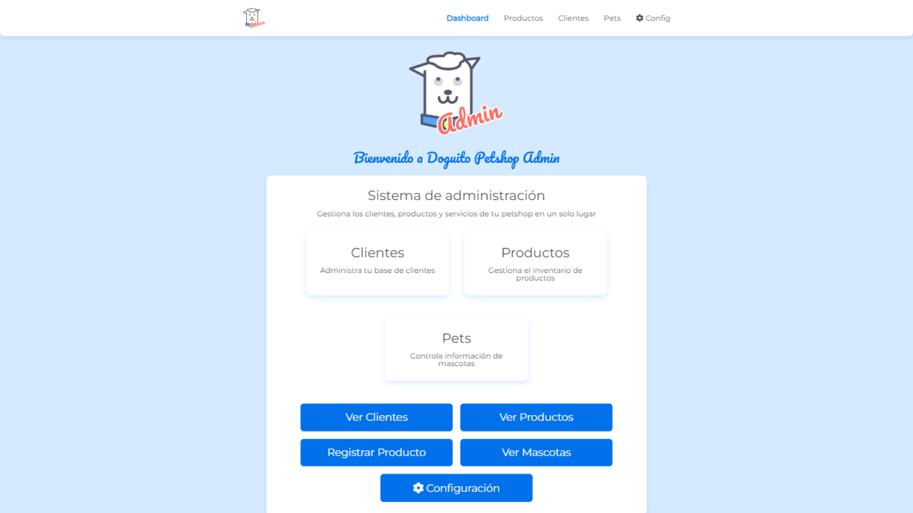
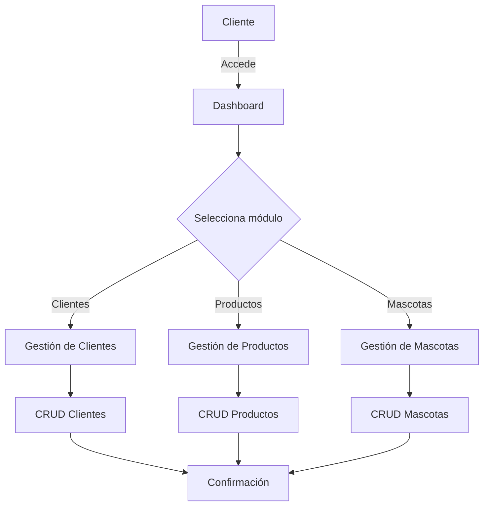

# 🐶 Doguito Petshop Admin

<div align="center">


[](https://crud-liart.vercel.app/)
[](https://crud-api-emg1.onrender.com/)


<h3>✨ Sistema de administración completo para una tienda de mascotas</h3>
<p>Una solución integral para gestionar clientes, productos y mascotas</p>

<br>

[🚀 Ver Demo](https://doguito.devsandoval.me/) | [🔧 API Demo](https://crud-api-emg1.onrender.com/)

</div>

<hr>

## 📱 Demo Interactivo

<div align="center">
   
</div>

## ✅ Características Principales

<table>
  <tr>
    <td>
      <h3>📋 Gestión Completa</h3>
      <ul>
        <li>✅ CRUD completo y optimizado</li>
        <li>✅ Validación de formularios</li>
        <li>✅ Notificaciones interactivas</li>
      </ul>
    </td>
    <td>
      <h3>👤 Clientes</h3>
      <ul>
        <li>✅ Agregar nuevos clientes</li>
        <li>✅ Actualizar información</li>
        <li>✅ Gestión de cuentas</li>
      </ul>
    </td>
  </tr>
  <tr>
    <td>
      <h3>🛍️ Productos</h3>
      <ul>
        <li>✅ Catálogo de productos</li>
        <li>✅ Precio y descripciones</li>
        <li>✅ Gestión de inventario</li>
      </ul>
    </td>
    <td>
      <h3>🐾 Mascotas</h3>
      <ul>
        <li>✅ Registro de mascotas</li>
        <li>✅ Asociación con dueños</li>
        <li>✅ Historial completo</li>
      </ul>
    </td>
  </tr>
</table>

## 🔧 Tecnologías Utilizadas

<div align="center">

### 🌐 Frontend


### ⚙️ Backend


### 🛠️ Herramientas


</div>

## 💻 Instalación Rápida

```bash
# 1. Clona el repositorio
git clone https://github.com/sandovaldavid/CRUD.git
cd CRUD

# 2. Instala las dependencias
npm install

# 3. Inicia el entorno de desarrollo
npm run dev
```

### 🚀 Servidor de desarrollo

-   🔌 **API**: http://localhost:3000
-   🌐 **Frontend**: http://localhost:5000

## 🔄 Flujo de trabajo



## 🌐 Despliegue

<table>
  <tr>
    <th>📱 Frontend</th>
    <th>⚙️ Backend (API)</th>
  </tr>
  <tr>
    <td>
      <h4>Vercel (Recomendado)</h4>
      <ol>
        <li>Conecta tu repo de GitHub a Vercel</li>
        <li>Vercel detectará la configuración automáticamente</li>
        <li>Despliega con un solo click</li>
      </ol>
    </td>
    <td>
      <h4>Render</h4>
      <ol>
        <li>Crea un Web Service en Render</li>
        <li>Configura: <code>npm install</code> como Build Command</li>
        <li>Configura: <code>npm run deploy:backend</code> como Start Command</li>
      </ol>
    </td>
  </tr>
  <tr>
    <td>
      <h4>Netlify</h4>
      <ol>
        <li>Conecta tu repositorio</li>
        <li>Build command: <code>npm run build</code></li>
        <li>Publish directory: <code>dist</code></li>
      </ol>
    </td>
    <td>
      <h4>Railway</h4>
      <ol>
        <li>Conecta tu repositorio a Railway</li>
        <li>Railway detectará el <code>package.json</code></li>
        <li>Usará <code>npm run deploy:backend</code> automáticamente</li>
      </ol>
    </td>
  </tr>
</table>

## 📖 Documentación

Para obtener más información sobre el proyecto, consulta:

-   [📝 Notas de lanzamiento (v2.0.0)](https://github.com/sandovaldavid/CRUD/releases/tag/v2.0.0)
-   [🔧 API Endpoints](https://crud-api-emg1.onrender.com/)

## 🤝 Contribución

¿Quieres contribuir? ¡Genial! Sigue estos pasos:

1. 🍴 Haz un Fork del proyecto
2. 🔧 Crea una rama para tu función (`git checkout -b feature/amazing-feature`)
3. 💻 Realiza tus cambios y haz commit (`git commit -m 'Add amazing feature'`)
4. 📤 Sube los cambios (`git push origin feature/amazing-feature`)
5. 📩 Abre un Pull Request

## 🚧 Próximos pasos

-   [ ] 📱 Interfaz responsiva mejorada para dispositivos móviles
-   [ ] 🌙 Modo oscuro
-   [ ] 🔍 Búsqueda avanzada en listas
-   [ ] 📊 Panel de estadísticas

## 📄 Licencia

<div align="center">

Este proyecto está bajo la Licencia MIT - ver el archivo [LICENSE](LICENSE) para más detalles.

</div>

---

## 👨‍💻 Autor

<div align="center">
  
  <h3>David Sandoval</h3>

[](https://devsandoval.me)
[](https://linkedin.com/in/devsandoval)
[](https://github.com/sandovaldavid)
[](mailto:contact@devsandoval.me)

</div>

---

> **Nota**: Este proyecto fue creado con fines educativos y de entretenimiento. Siéntete libre de
> utilizarlo y modificarlo según tus necesidades.
